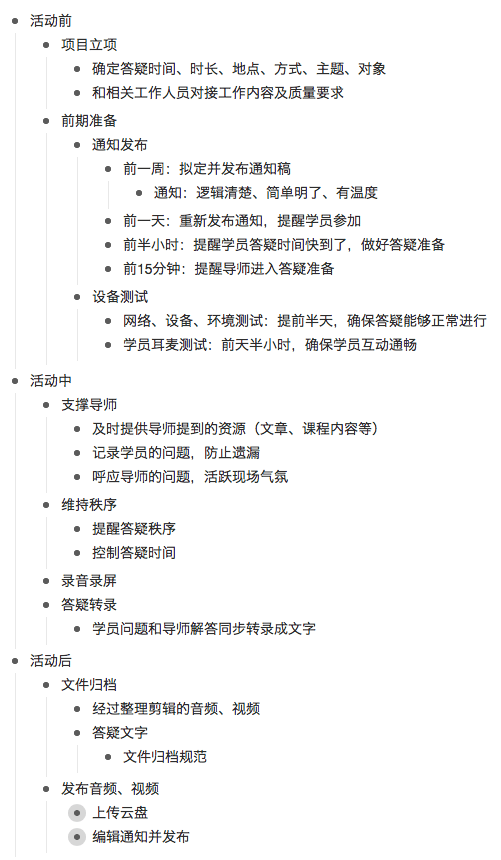
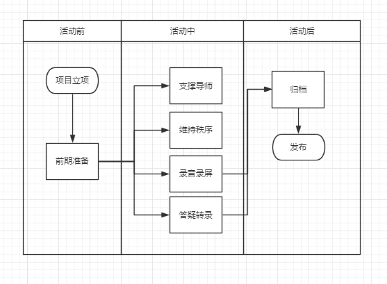

# 如何教他人做一个小技能包

## 〇、准备

统筹考虑，自己的技能包已经是封装过的产品，所以，我们在开始做之前就要做产品化准备，而不是等着都做完了，再重新考虑产品化。所以，前期我们要做一些简单的准备，也就是，我们的技能包的出处是使用Github来完成的。

所以，请完成以下两步操作:

1. 注册Github的账号
2. 新建一个全新的Repo，注意Repo的命名、描述、初始化README.md文件、增加忽略文档，然后确定。

这样，前期准备就完成了。

## 一、步骤及流程

做技能包，我们要根据做什么事情(What)、为什么要做这件事情(Why)、怎么做(How)的整体思路来进行。具体请参考：

- 《[永澄：如何从0开始搭建一个小系统](http://mp.weixin.qq.com/s?__biz=MzIzOTY0OTA3OA==&mid=2247484115&idx=1&sn=af2349db5e32490cefca20a031401216&chksm=e927aa8ade50239c5b5401ca31e0bb3ba8e4d274cf14852451e41410af491312e768fff07b20#rd)》

### （一）What：说明自己要做一个什么样事情

首先必须要把对象说清楚，我建议选择一个非常小的技能开始，因为技能可以帮助自己快速提升。具体可以参考：

- 《[永澄：最简单的方式实现自我提升](http://mp.weixin.qq.com/s?__biz=MzIzOTY0OTA3OA==&mid=2247484039&idx=1&sn=a403f23a15867a4b8ce5aa34052000fd&chksm=e927aadede5023c8613e823ca39c0ea289a9465ea921d1c73dd310e34dc7c7d3c27b3e8ffc5c#rd)》

范例：

```
李敏嘉认定自己要选择：如何组织实施答疑
```

强烈建议，在做之前自己的脑海中一定要想清楚，这件事情尽可能是有思路的，如果没有思路并且从来没有做过，建议使用**渐进明晰**的方式推进，而不是用**封装技能系统**的思路工作。

### （二）Purpose：澄清封装该技能包的目的

在知道自己要做什么的第一时间，就要考虑目的是什么，目的不清的话，后续推进的效率就会大打折扣。目的是**你做所以要做某事的意图**，目的是对内心动机的澄清，只有动机明确，才可以保证任务在推进的稳定和持续。

询问目的的常见话术有：

- 你为什么要做这件事？
- 这件事对我来说为什么这么重要？
- 这件事如果达成的话，谁会从中收益？

范例：

```
李敏嘉关于封装“组织答疑”技能包的目的：
    
1. 能够把事情放心的交接出去，而不会影响质量
2. 形成组织活动的小技能
3. 有完整的系统的内容，节省以后组织的时间
```

**注意**：很多人认为只要把目的写下来就好了，但这是远远不够的，做了这么久咨询之后，我知道，动机都比较深层次，太浅的动机不见得有力量。所以，这里必须使用度量尺来进行度量。话术的对象是：“是否心动”，背后的逻辑是：任何改变必须是感性先动，理性跟进。更多资料请查看：

- 《[永澄：改变的底层套路是什么？](http://mp.weixin.qq.com/s?__biz=MzIzOTY0OTA3OA==&mid=2247484071&idx=1&sn=559bfe37777c60245db96f94d5e6ef60&chksm=e927aafede5023e83c73c1749fccbf2f85370a5fedcaaeb47cd0195ed4f97e8b61f2b37a7c27#rd)》

话术如下：“当看到这个目的的时候，会非常心动并想立刻开始做，那就打10分，否则就是0分，你会为自己打几分？”

```
李敏嘉的范例

当我第一次询问的时候，她给自己打分为8、9、9分，后来要求改变，她将目的调整成：

1. 可以拥有持续优化的基础
2. 形成组织活动的小技能
3. 有完整的系统的内容，节省以后组织的时间
4. 可以不费口舌的把工作交接出去，节省对接的时间和教导的时间，还不影响质量

并分别打分为：10分、9分、9分、9分。
```

###  （三）Workflow：形成业务流程思路和流程图

业务流程是为达到特定的价值目标而由不同环节(可由一人实现也可以由多人分工实现)共同组成的一系列活动的集合。我们定义某一组活动为一个业务流程，这组活动有一个或多个输入，输出一个或多个结果，这些结果对客户来说是一种增值。简言之，**业务流程是一系列创造价值的活动的组合，是把你的目的实现的整体方法**。

可以这么理解，业务流程就是系统，只关注输入和输出的黑盒子。一个好的系统内部设计，是保证整个体系得以灵活运行的关键。所以，通常我们采用**层次打开**的方式来理解系统，即：

- 整体思路结构：打开系统的外观，直接看到系统由几部分组成。
- 细节流程组合：继续打开每个部分，看看每个部分是如何具体构成的。

范例
```
当我询问李敏嘉的业务流程是如何的，她给的答案如下:
    
1. 确定答疑项目的负责人和目的， 答疑地点，答疑人群
2. 对接答疑导师的时间，答疑时长，确定答疑主题
3. 拟定答疑通知,活动开始前一周发布通知，活动开始前一天提醒，活动开始半小时前倒计时提醒。
4. 活动开始前1天，找好录音、录屏的人员，及备份人员
6. 活动开始前半天确认答疑场地，设备、网络、录音没问题
7. 活动开始前15分钟提醒答疑导师，确认到场情况
8. 活动负责人从活动开始半小时前需要到场，和人员保持互动，
9. 活动正式开始，过程中随时记录导师的要求，提供材料，记录活跃用户
10. 答疑结束整理并提供答疑录音、录屏
```

从李敏嘉的业务流程来看，她是从底层切入的，这样可能在整体性上缺乏考虑，很容易陷入在细节，未来在能力迁移时受到限制。核心原因：**结构性思维的结论先行训练不足**。再次强调，在构建系统时，结构性思维极其重要!

指出问题后，我们决定将思路定成：活动前、活动中和活动后，也就是说，组织实施一个活动要考虑这三方面的事情。所以，整体思路上按照**阶段性**来进行划分。不要觉得简单，简单的思路更容易迁移。

> Tips：这里可以使用幕布/脑图的方式来进行结构化。要确保一级大纲中要有非常明确的逻辑。

范例
```
李敏嘉整理后的范例
请查看下方图片
```


思路明确之后，接下来考虑的是就是：继续打开盒子，看到每个部分(阶段、结构)中的细节流程。

> Tips：这个环节可以使用http://processon.com进行流程图绘制。建议考虑文件命名、区分文件夹并持续积累，可以积累极大势能。具体见：《[永澄：如何梳理自己的能力并实现盈利？](http://mp.weixin.qq.com/s?__biz=MzIzOTY0OTA3OA==&mid=2247484086&idx=1&sn=6976d2327bac75d313978d6351697ebd&chksm=e927aaefde5023f9ee8aa6d65acd455cf96a26d6153192e496df4068058a4aa3df9a8fd55829#rd)》

范例：



###  （四）Detail：具体细节

拟定并发布通知稿：用什么工具、写成什么样、写成什么标准、
每次怎么发、找模板、改哪些字、改什么标准、
做的过程中用最懒的方式做，（最懒的方式，我只要列出一遍，从此以后就再也不用做了。）

一定要足够清楚，这里接风雨阳光的文章，接一个范例

###  （五）CheckList：检查清单对应

- - - - 

#### ChangeLog

- 2017年02月11日
- 易仁永澄


